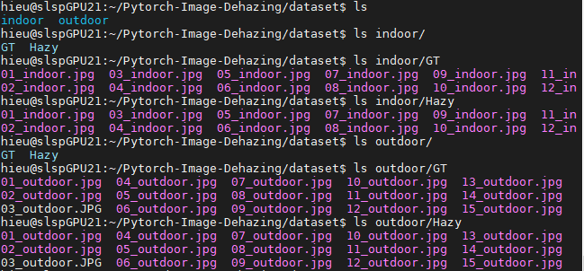
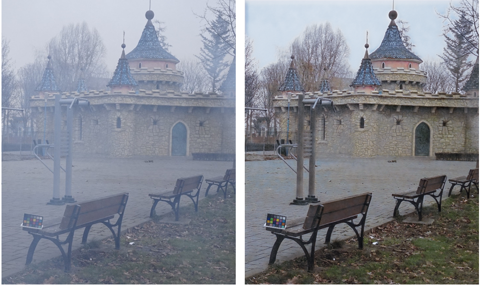

# GAN-based Image Dehazing

This project is to implement a GAN-based method for Image Dehazing


_Figure 1. Generator. The generator can directly output the haze-free images without estimation of intermediate parameters._


_Figure 2. Discriminator. The discriminator can guide the generator to generate more realistic dehazed results._

To run this project you need to setup the environment, download the dataset, and then you can train and test the network models. I will show you step by step to run this project and I hope it is clear enough.

## Prerequisite

The project is tested on Ubuntu 16.04, GPU Titan V. Note that one GPU is required to run the code. Otherwise, you have to modify code a little bit for using CPU. If using CPU for training, it may too slow. So I recommend you using GPU strong enough and about 12G RAM.

## Dependencies

Python 3.5 or 3.6 are recommended.

```
tqdm==4.19.9
numpy==1.17.3
tensorflow==1.12.0
tensorboardX
torch==1.0.0
Pillow==6.2.0
torchvision==0.2.2
```

## Environment

I recommend using `virtualenv` for making an environment. Run the following commands in the root folder.

```
virtualenv -p python3 .env
source .env/bin/activate
pip install -r requirements.txt
```

## Dataset

I use NTIRE 2018 datasets including I-HAZE ([Download](http://www.vision.ee.ethz.ch/ntire18/i-haze/)) and O-HAZE ([Download](http://www.vision.ee.ethz.ch/ntire18/o-haze/)).

|        |  Training Images   |  Testing Images   |
| :----: | :----------------: | :---------------: |
| I-HAZE | 25 (from 01 to 25) | 5 (from 31 to 25) |
| O-HAZE | 35 (from 01 to 35) | 5 (from 41 to 45) |

After downloading dataset successfully, you need to put images in right folders. <br/>By default:  

+ dataset/indoor/hazy: includes 25 hazy images from 01 to 25 in **I-HAZE** dataset
+ dataset/indoor/GT: includes 25 ground-truth images from 01 to 25 in **I-HAZE** dataset
+  dataset/outdoor/hazy:  includes 35 hazy images from 01 to 35 in **O-HAZE** dataset
+ dataset/outdoor/GT: includes 35 ground-truth images from 01 to 35 in **O-HAZE** dataset



## Demo

I provide pretrained models ([here](https://drive.google.com/open?id=1t66aicSFaG1iY9xhHiaVCxFkzc7-6e9I)). Downloading the zip file and extracting to _trained_model_ folder. You can generate de-hazy images by running the following commands.

For one input images:

```
python demo.py --model trained_model/indoor.pt --images inputs/31.png --gpu 0
```

```
python demo.py --model trained_model/outdoor.pt --images inputs/41.png --gpu 0
```

For multiple input images:

```
python demo.py --model trained_model/indoor.pt --images inputs/31.png inputs/32.png inputs/33.png inputs/34.png inputs/35.png --gpu 0
```

```
python demo.py --model trained_model/outdoor.pt --images inputs/41.png inputs/42.png inputs/43.png inputs/44.png inputs/45.png --gpu 0
```

Some dehazed-images generated by my model. Left image: hazy image. Right image: dehazed image.




## Training

Training a model on I-HAZE dataset

```
python main.py --data_dir dataset/indoor --exp indoor --gpu 0
```

Training a model on O-HAZE dataset

```
python main.py --data_dir dataset/outdoor --exp outdoor --gpu 0
```

## Testing

I evaluate my models by NIQE score. The NIQE source code is available at [here](https://www.dropbox.com/s/o8ptao3fvub7a6f/evaluation_code.zip?dl=0). 

|             | Hazy Images | Without GAN | With GAN |
| :---------: | :---------: | :---------: | :------: |
| **Indoor**  |   6.4564    |   6.7746    |  4.9167  |
| **Outdoor** |   4.1471    |   4.4204    |  2.6605  |


